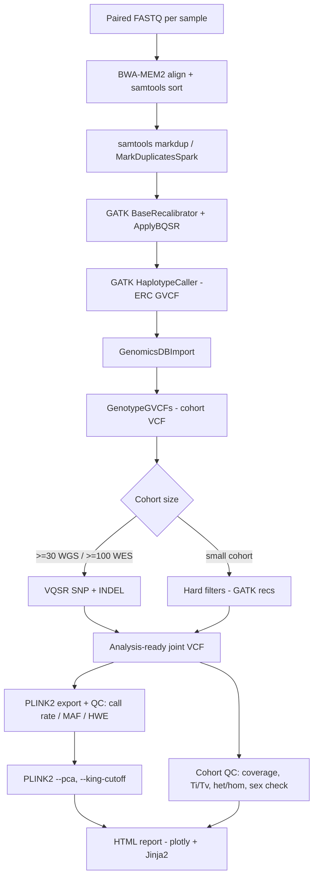

# germline-flow

A reproducible **germline short-variant calling** Snakemake pipeline that takes paired-end
short-read sequencing data from FASTQ to analysis-ready joint-called VCF and PLINK2
genotypes, with integrated cohort-level quality control and a self-contained HTML report.
The workflow implements the [GATK Best Practices for germline short variants][gatk-bp]
and is designed to run unchanged on a laptop, a shared workstation, or a SLURM cluster.

> **Status:** research and education tooling. Do **not** use the output of this pipeline
> to make clinical, diagnostic, or treatment decisions without independent revalidation in
> a properly accredited laboratory (e.g., CAP/CLIA in the US, ISO 15189 elsewhere).
> See the [Disclaimer](#disclaimer) below.

---

## What this pipeline does (plain English)

When a human genome is sequenced on an Illumina-style short-read machine, the raw output
is millions of ~150 bp DNA fragments stored as FASTQ files. **Germline variant calling**
is the process of comparing those fragments to a reference human genome and producing a
list of the inherited (germline) places where this individual differs from the
reference — single-nucleotide variants (SNVs) and small insertions/deletions (indels).

The pipeline chains four canonical tools:

| Tool | What it does | Why we use it |
|------|--------------|---------------|
| **BWA-MEM2** | Aligns each FASTQ read to its most likely position in the reference genome. | BWA-MEM2 is the de-facto standard short-read aligner — fast, accurate on Illumina data, and is what GATK Best Practices is benchmarked against. |
| **samtools** | Sorts, indexes, and deduplicates the resulting BAM files. | The downstream callers need coordinate-sorted, indexed BAMs with PCR/optical duplicates flagged so they aren't double-counted as evidence. |
| **GATK4** | Recalibrates base qualities (BQSR), calls per-sample gVCFs (HaplotypeCaller), and jointly genotypes the cohort (GenomicsDBImport + GenotypeGVCFs), then filters with VQSR or hard filters. | The GATK Best Practices joint-calling workflow is the reference implementation for germline short variants in human cohorts; it gives substantially better sensitivity for rare alleles than calling each sample alone. |
| **PLINK2** | Exports analysis-ready genotypes (`.pgen`/`.pvar`/`.psam`), runs sample/variant QC, principal-components analysis, and KING-robust kinship. | PLINK2 is the lingua franca of downstream statistical genetics (GWAS, PRS, kinship, ancestry) and produces compact binary formats that scale to millions of variants and hundreds of thousands of samples. |

---

## Pipeline diagram



---

## Quickstart

### Prerequisites

* Conda or [Mamba](https://github.com/mamba-org/mamba) (Mamba strongly recommended — Snakemake env solves are much faster)
* Snakemake >= 7.32 (`mamba install -n base -c bioconda snakemake`)
* A POSIX shell (Linux or macOS; Windows users: WSL2)
* ~20 GB free disk for the bundled test data and reference index; full WGS cohorts will need substantially more

### 1. Clone

```bash
git clone https://github.com/<your-org>/germline-flow.git
cd germline-flow
```

### 2. Edit the sample sheet and config

`config/samples.tsv` is a tab-separated file with one row per sample:

```
sample    fastq_1                          fastq_2                          sex
NA12878   data/fastq/NA12878_R1.fastq.gz   data/fastq/NA12878_R2.fastq.gz   F
NA12891   data/fastq/NA12891_R1.fastq.gz   data/fastq/NA12891_R2.fastq.gz   M
NA12892   data/fastq/NA12892_R1.fastq.gz   data/fastq/NA12892_R2.fastq.gz   F
```

`config/config.yaml` points at the reference genome, known-sites VCFs, calling intervals,
and lets you toggle VQSR vs hard-filtering, MarkDuplicatesSpark vs `samtools markdup`,
and the PLINK QC thresholds.

### 3. Run locally

```bash
# dry-run (prints the DAG, executes nothing)
snakemake -n --use-conda

# real run on N cores
snakemake --use-conda --cores 8
```

### 4. Run on SLURM

A ready-made Snakemake profile is included.

```bash
snakemake --profile profiles/slurm --use-conda
```

The profile maps each rule's `resources:` block (memory, walltime, threads) into the
appropriate `sbatch` flags. Edit `profiles/slurm/config.yaml` to set your partition,
account, and per-rule resource overrides.

### 5. Read the report

```bash
# open the HTML report in the default browser
xdg-open results/report/cohort_qc.html   # Linux
open     results/report/cohort_qc.html   # macOS
```

---

## Repository layout

```
germline-flow/
├── README.md
├── LICENSE                       GPL-3.0
├── Snakefile                     top-level entry point; includes all rule files
├── Makefile                      make test / make lint / make report
├── config/
│   ├── config.yaml               reference paths, intervals, resources, QC thresholds
│   └── samples.tsv               example sample sheet (sample, fastq_1, fastq_2, sex)
├── workflow/
│   ├── rules/
│   │   ├── align.smk             BWA-MEM2 -> sorted BAM
│   │   ├── markdup.smk           samtools markdup / MarkDuplicatesSpark
│   │   ├── bqsr.smk              BaseRecalibrator + ApplyBQSR
│   │   ├── callvariants.smk      HaplotypeCaller -ERC GVCF
│   │   ├── jointgeno.smk         GenomicsDBImport + GenotypeGVCFs + VQSR/hard filter
│   │   ├── qc.smk                CollectVariantCallingMetrics, coverage, Ti/Tv, sex
│   │   └── export.smk            PLINK2 export, sample/variant QC, PCA, KING
│   ├── envs/                     one conda YAML per tool family
│   └── scripts/
│       ├── cohort_qc.py          aggregate per-sample metrics into one table
│       ├── make_report.py        Jinja2 + plotly HTML report builder
│       ├── sex_check.py          genetic sex from chrX / chrY coverage ratio
│       └── relatedness.py        post-process PLINK2 KING output for the report
├── profiles/slurm/config.yaml    Snakemake SLURM profile
├── .github/workflows/ci.yml      lint + tiny end-to-end test in CI
├── test/                         downsampled chr20 FASTQs + expected outputs
└── cookbook/                     end-to-end real-world recipes (trio, small cohort, etc.)
```

---

## Configuration reference (excerpt)

```yaml
# config/config.yaml
samples: config/samples.tsv

reference:
  fasta: resources/reference/GRCh38.primary_assembly.genome.fa
  known_sites:
    - resources/reference/Mills_and_1000G_gold_standard.indels.hg38.vcf.gz
    - resources/reference/dbsnp_151.hg38.vcf.gz
  # restrict calling to these intervals (BED or GATK .interval_list). Use chr20 only for CI.
  calling_intervals: resources/reference/wgs_calling_regions.hg38.interval_list

joint_calling:
  # one of: "vqsr" or "hard_filter". VQSR needs >=30 WGS or >=100 WES samples.
  filter_mode: hard_filter

qc:
  coverage_threshold: 20          # report % bases covered >= this depth
  titv_min: 1.9                   # WGS expected ~2.0-2.1; WES expected ~3.0-3.3
  titv_max: 3.5

plink_export:
  call_rate_min: 0.95             # drop variants/samples below this
  maf_min: 0.01                   # minor-allele-frequency floor
  hwe_p_min: 1.0e-6               # Hardy-Weinberg p-value floor (controls only)
  king_cutoff: 0.0884             # 2nd-degree relatives; PLINK2 default
```

---

## Citations

If you use this pipeline in published work, please cite:

* **GATK Best Practices** — Van der Auwera GA, O'Connor BD. *Genomics in the Cloud: Using Docker, GATK, and WDL in Terra*. O'Reilly Media, 2020. ISBN 9781491975190. See also [gatk.broadinstitute.org/hc/en-us/sections/360007226651-Best-Practices-Workflows][gatk-bp].
* **BWA-MEM2** — Vasimuddin M, Misra S, Li H, Aluru S. "Efficient Architecture-Aware Acceleration of BWA-MEM for Multicore Systems." *IPDPS 2019*.
* **samtools** — Danecek P et al. "Twelve years of SAMtools and BCFtools." *GigaScience* 2021;10(2):giab008.
* **GATK4 / HaplotypeCaller** — Poplin R et al. "Scaling accurate genetic variant discovery to tens of thousands of samples." *bioRxiv* 201178 (2017).
* **PLINK 2** — Chang CC et al. "Second-generation PLINK: rising to the challenge of larger and richer datasets." *GigaScience* 2015;4:7.
* **Snakemake** — Mölder F et al. "Sustainable data analysis with Snakemake." *F1000Research* 2021;10:33.

[gatk-bp]: https://gatk.broadinstitute.org/hc/en-us/sections/360007226651-Best-Practices-Workflows

---

## Intended users / why this exists

This pipeline is aimed at **small academic genetics labs, core facilities supporting a
handful of investigators, and graduate courses in statistical genetics** that need a
clean, reproducible germline calling workflow without owning a commercial product like
DRAGEN or Sentieon and without re-engineering the GATK Best Practices from blog posts
every six months. Specifically:

* **A trainee can run the test cohort in CI in <15 minutes** and immediately see what
  every stage produces and *why* the QC plots in the report look the way they do — each
  plot is captioned with a one-paragraph teaching note.
* **A PI can deploy it on a SLURM cluster** by editing one YAML file and hand a working
  pipeline to a new postdoc on day one.
* **A bioinformatics core can extend it** — the rule files are short (<100 lines each),
  every rule pins its own conda env, and the Python QC code is type-hinted and unit-
  testable.

It is *not* trying to replace nf-core/sarek, DRAGEN-GATK, or a fully validated clinical
production system. It is trying to be the smallest reproducible thing that follows the
Best Practices and produces an HTML report you can hand to a wet-lab collaborator.

---

## Cookbook

End-to-end worked examples with real public data live under [`cookbook/`](cookbook/):

* [`01-trio-analysis.md`](cookbook/01-trio-analysis.md) — call a NA12878/NA12891/NA12892 trio from GIAB, run Mendelian-error QC against `rtg vcfeval`.
* [`02-small-cohort-gwas.md`](cookbook/02-small-cohort-gwas.md) — 1000 Genomes chr22 mini-cohort, hand off to PLINK2 `--glm` for an association sketch.
* [`03-exome-cohort.md`](cookbook/03-exome-cohort.md) — switch the intervals file and `filter_mode: hard_filter` for a 20-sample WES study.
* [`04-integrations.md`](cookbook/04-integrations.md) — plugging the output into VEP, snpEff, Hail, OpenCRAVAT, and the GA4GH `vcfeval` benchmarking workflow.

---

## Disclaimer

This software is provided for **research and educational purposes only**. It is **not**
a medical device, has not been validated for clinical use, and must not be used as the
sole basis for any clinical, diagnostic, therapeutic, or reproductive decision. The
GATK Best Practices implementation here is faithful to the published recommendations but
is not a substitute for an accredited clinical laboratory workflow (CAP/CLIA, ISO 15189,
or equivalent). The authors and contributors disclaim all liability for any consequences
arising from the use of this software. See the [LICENSE](LICENSE) (GPL-3.0) for the
formal warranty disclaimer.

---

## License

[GNU General Public License v3.0](LICENSE).
